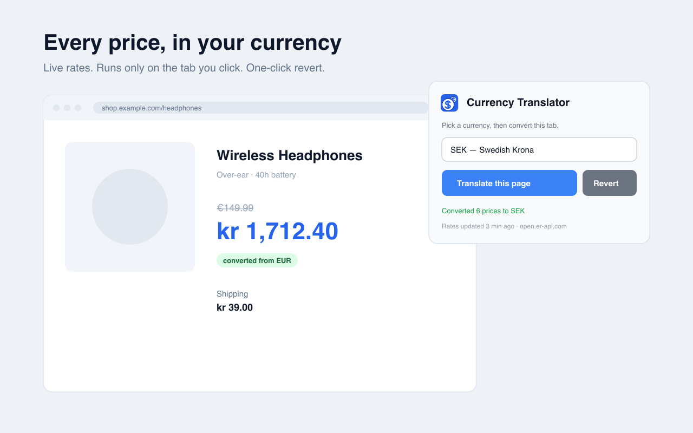

# Live Currency Translator

[](https://github.com/horotat/live-currency-translator/actions/workflows/ci.yml)
[](https://chromewebstore.google.com/detail/live-currency-translator/bddnijmjhfgmbkknmgaeeceghfemkkcd)
[](LICENSE)


A Chrome extension (Manifest V3) that converts the prices shown on any web page
into your preferred currency, using live exchange rates. Click the toolbar icon,
pick a currency, and every price on the page is rewritten in place — with a
one-click revert.

- **Install:** [Chrome Web Store](https://chromewebstore.google.com/detail/live-currency-translator/bddnijmjhfgmbkknmgaeeceghfemkkcd)
- **Website & live calculator:** https://currency.alireza.mk/
- **Report a page that doesn't convert:** [new issue](https://github.com/horotat/live-currency-translator/issues/new/choose)



## How it works

- Click the toolbar icon and pick a target currency.
- The extension asks for one-time access to the **current tab only**
  (`activeTab`) and injects a small script that rewrites currency amounts in the
  page's text.
- A `MutationObserver` keeps converting prices that load in later (infinite
  scroll, single-page apps).
- **Revert** restores every original value.

Exchange rates are fetched once and cached for 6 hours in local extension
storage. The only network request is an unauthenticated
`GET https://open.er-api.com/v6/latest/USD` (fallback:
`https://api.frankfurter.dev`). No account, no API key, no tracking — see
[PRIVACY.md](PRIVACY.md).

## Install

Most people should use the [Chrome Web Store listing](https://chromewebstore.google.com/detail/live-currency-translator/bddnijmjhfgmbkknmgaeeceghfemkkcd).

To run from source:

```bash
git clone https://github.com/horotat/live-currency-translator.git
cd live-currency-translator
npm install
npm run icons
```

Then in Chrome: `chrome://extensions` → enable **Developer mode** → **Load
unpacked** → select this folder.

## Known limitations

- **Ambiguous `$`.** More than 20 currencies use the `$` sign. When a page shows
  `$` with no ISO code and no other clue, the extension assumes **US dollars**.
  It does use the site's country domain (`.ca`, `.au`, …) and language as hints,
  but a `.com` page that quietly prices in Canadian or Australian dollars will
  convert wrong. Prices that name the currency (`CAD $`, `A$`, `AUD 12.00`)
  convert correctly. The same applies to a bare `kr` (assumed SEK) and a bare
  `¥` (assumed JPY).
- **Split-price widgets** where the symbol, whole number and cents are separate
  page elements need per-site support. Amazon's `.a-price` is handled; other
  retailers' custom markup has to be added one at a time.

## Develop

```bash
npm test      # node:test unit tests
npm run lint  # manifest security check + syntax check of every source file
```

The **shipped extension has zero runtime dependencies** — everything in `src/`
is dependency-free vanilla JS with no build step. The only dev dependency
(`sharp`) is for rasterizing the icon.

- `src/lib/currency.js` — parsing, symbol resolution, conversion, formatting (pure, unit-tested)
- `src/lib/rates.js` — fetch + validate + cache with provider fallback (unit-tested with mocks)
- `src/background.js` — service worker: owns all network access, injects the content script
- `src/content.js` — DOM walk, `MutationObserver`, revert
- `src/popup.*` — UI
- `scripts/check-manifest.mjs` — fails the build if the manifest ever declares a
  permission outside `{activeTab, scripting, storage}`, adds `host_permissions`,
  a static `content_scripts` block, or a custom CSP.

## Releases

Tagging `vX.Y.Z` builds the zip, publishes a GitHub Release, and (once the
Chrome Web Store API secrets are configured) uploads the new version to the
store for review. See [`.github/workflows/release.yml`](.github/workflows/release.yml).

## Contributing

Bug reports (especially "site X doesn't convert"), fixes, and ideas are welcome
— see [CONTRIBUTING.md](CONTRIBUTING.md) for what makes a report actionable and
how the code is structured. Security issues: [SECURITY.md](SECURITY.md).

## Credits

Exchange rates by [open.er-api.com](https://www.exchangerate-api.com); fallback
by [Frankfurter](https://frankfurter.dev).

## License

MIT — see [LICENSE](LICENSE).
